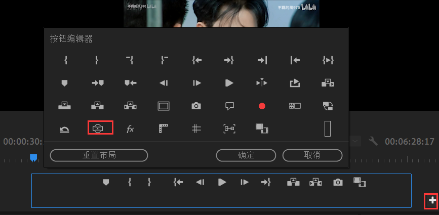
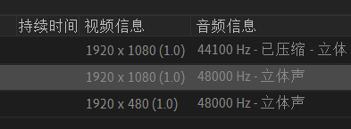

# hero

## 熟悉pr工作环境

最开始的剪辑就是哪一张胶片上的镜头你不想要了，你就把它剪掉，然后重新整合。

现在的pr也是如此。

pr将所有镜头(所有剪辑片段)通过时间线进行重新排列，所有我们最初需要一条空的时间线(胶片条)，然后把这些镜头剪辑整合填到这条时间上即可。

## pr软件界面初识

组件可以随意拖动到另一个组件的上下左右，也可以和另一个组件合为一组(拖到另一个组件的中间就是这个效果)。也可以浮动，也可以关闭，**关闭之后在窗口处能够找到所有的组件**。

当然，你也可以随意放大缩小，都是非常简单的操作。

你可以布局一个自己喜欢的工作区，然后在：窗口--->工作区--->另存为新工作区 进行保存。

你也可以对此工作区进行更新并保存(默认存在的工作区只能是另存为)，或者你调得很乱了，也可以恢复默认。

点击所有面板会显示所有控件，你可以在窗口中找到它们。编辑工作区可以管理已有的工作区(学习，组件，编辑，颜色...)，包括删除(不能删默认存在的，只能删自己的)，排序。

## 工作流程初识

**==序列就是相当于时间线，相当于空白的胶片==**/**工作的前提是要有序列，不然你的镜头放到哪里呢**。

**最简单创建序列的方式，先导入媒体，然后将媒体拖到时间轴那一栏，就会得到一个默认的序列**。

现在我们练习剪掉片尾的谢谢观看。

截图中存在`00:00:00:00`或者`00:00:38:19`这样的字样，它们的单位是`时分秒帧`。

你可以在**蓝色字体处(第一处蓝色，)**手动输入数字以跳到想要达到的时间单位。

我们当然可以单纯的使用鼠标拖动时间指针(那根小竖线)去寻找想要的画面，不过这太难以精确的控制。所以可以按下键盘上的**左右方向键**去逐帧的寻找。

现在我们要剪掉片尾的谢谢观看，那么你必须要逐帧的向前移动(倒退)，**==直到完全看不到谢谢观看这几个字==**。

此时你把鼠标放到片段的末尾会形成这样的一个**小图标**，然后把它往前拖到与那条时间线重合，就是剪掉末尾了。

但是你会发现这样没有剪掉音频，原因是你没有选中音频。你需要在这个**小图标**生成以后，**按下shift，然后点击末尾这段视频，再次按下shift，点击末尾这段音频**。这样子就是剪掉末尾的所有了。

当然你也可以直接选中音频，只剪掉音频。

****

现在我们要剪掉开始这几个字，同样的，逐帧向后进行移动，直到这几个字完全消失。

现在我们可以换一种方式剪掉这个片头。

然后选择工具栏中的剃刀工具，将其拖到与时间线重合，你可以考虑剪掉视频还是音频，选中后双击鼠标即可。如果音频和视频都不想要，用shift进行选中即可。或者你先剪视频，再剪音频。

然后片段会被一分为二，然后切换为选择工具，就是第一个图标那个箭头，选择前半部分不要的素材，直接按**Delete**键即可删除。**或者先点击鼠标左键，再选择清除(这里也可以直接波纹删除，一步到位)**。

**==然后前面部分会变成黑色，右键点击选中会变白，然后左键选择波纹删除就对齐到最左端了==**。

收尾工作：文件--->导出--->媒体。

必须是H264，以确保最后的文件格式是MP4。

***

**最后，如果你还没有导出，也就是没有编辑完成。想要下次在此基础上继续，记得保存，pr可不会给你自动保存.**

## 了解重要项目参数设置

编辑--->首选项--->常规。

假设你又连音箱，又连耳机，这个软件可能不知道将声音输出到哪里，于是没有声音。

到了20，又从1开始，而不是停止。

美国选30fps，亚洲选25.00fps。

记得改到D盘，可以是D盘的不同文件夹。

## 新建项目

渲染一般默认的就是加速最快的/

时间码:00:00:15:03

英尺+帧：适用胶卷，很少适用。

画框(frame)：就是帧，将00:00:15:03转换为帧显示。适用三维软件。

## 导入素材

* 直接拖入编辑区
* 双击编辑区
  * 导入文件(一个或多个)
  * 导入文件夹，会形成素材箱 

如果导入的多个文件想要进行归类，可以选中它们然后往新建素材箱那个图标拖，这样也会形成素材箱/

也可以先建立好素材箱，放入素材。

如果你的素材是PSD这种类型的分层素材，你可以有多种可选的导入方式。可以对所有的图层做一个选择，

整体(形成的是一张图片)，选择部分(形成的是一张图片)，全散开(形成多张图片)导入。序列(会比各个图层多出来一项)应该可以用来制作动画。与ps联动。

序列帧：现在我有一组马路延时的素材，它是以一帧一帧的照片的形式进行输出(以帧的方式一张一张的连续性的图片进行储存)，但是如果我们想要以视频的方式播放它，那么我们就需要以序列帧的方式进行导入。

这样以文件夹的方式导入是没有作用的，它是以一张一张图片的方式进行导入。我们是没有办法全选然后加载到序列当中的(可以但是不对)。

我们希望一张图片是一帧，但是现在一张图片是5秒。

正确方式是，根据你的命名，选中第一张图片，然后勾选图像序列，电脑就能够自动识别这是一个序列帧了，导入进pr就是一个序列帧视频。

如果图片不超过100张，命名是`00~99`。如果图片不超过1000张，命名是00~990。以此类推。

有一些专业设备拍出来的视频电脑自带的播放器不能够播放，我们可以在：

窗口--->媒体浏览器 中进行预览，如果觉得合适，可以直接在媒体浏览器中进行导入。

## 素材脱机与重新链接

or

素材脱机：你不小心移动了文件位置，导致pr不能够在原来的位置找到编辑过的文件。

在这一栏没有找到文件路径，没关系。任意在这些标题上点击鼠标左键，会出现元数据显示。会发现有各种各样的隐藏信息。

Premiere Pro项目元数据--->文件路径。

为了制造脱机，你可以选中素材，然后点击鼠标左键设为脱机。

想要恢复，仍旧在素材那里点击鼠标左键，然后选择链接媒体/

**记得整理好素材，查找的时候勾选自动重新链接其他媒体**。这样可以方便的链接回来。

脱机的意思是：假设你已经找回来了两个，别的实在找不到或者你不想要了，那么你可以将这个脱机，全都不想要了，就全部脱机。

to do：脱机的妙用。

## 文件序列的正确设置

时基就是帧速率。

在编辑模式中改为自定义，就可以更改**帧(frame)大小(分辨率)了**。

左边这个每秒钟少了10张画面，所以会略显卡顿，当然，你可以眨眼补帧。。。

现在直接选无场就可以了，预览直接默认，翻译也只是预览。帧速率一定要确定好，后期如果想从30帧改为25帧的话，会丢帧。

序列预设就是保存现在的设置，方便下一次使用。

这个确定之后，你也可以再更改这些设置。

先选中hero这个序列，然后点击序列(S)。

现在横纵比(分辨率)变为了4:1，所以将会是一个超长的视频(**长长 宽短的长方形**)。

因为原始视频是1080P,所以导入的时候分辨率是不同的，所以它给出了这样的提示。如果你点击更改序列设置，那么hero这个序列就会被更改为1080P。此时我们选择保持现有设置看看效果。

**此时我们点击==效果控件==缩放一下，可以发现只有中间有画面，左右都是留黑的**。

***

轨道最大可以99条。

可以不用一开始就进行创建，

点击那个+号那里也可以哦。

***

很显然，我们可以同时创建多个序列。假设此时hero是总序列，hero1是分场序列(我自己起的名字)，这样我们就可以在hero1上做一些分场剪辑(哭戏，或者场外镜头)。做完之后，直接跳转到总序列。

就像是拖素材一样将hero1序列拖到总序列hero上即可。

这样就是剪辑之内还有一个打包剪辑的效果。如果想要重新编辑hero1这样一个序列的话，直接双击绿色的就可以，要么你直接点击hero1/

**你可以看到，绿色部分音频轨道的前半部分是黑的，因为我拖媒体进hero1序列的时候，时间线不是从0帧开始的，所以前半部分没有声音也没有视频**。

现在我直接点击hero1将无音视频的部分剪掉，总序列hero也会发生同步的变化的。

**==这就是多个序列的套剪，以及混剪==**。

***

你点击这个x号，只是隐藏了这个序列，而不是删除。

将它拖到垃圾桶才是删除这个序列，顺便连这个序列上剪辑好的也一起删掉了。

**当然也可以鼠标左键，选择清除。另外，鼠标左键，也有更改这个序列的设置的选项**。

***

如果你在素材是标记了入出点，你可以鼠标左键清楚入出点。也可以在源面板左键进行设置。

## 源截取

如何抓取素材的镜头和音乐呢？我们可以选择双击素材，这样就得到源面板，在这里进行抓取。

左边的时间是时间轴，右边的时间是总片长。如果你抓取了某个片段，那么就会显示你抓取片段的总时长。

需要抓取片段，就需要设置入点和出点。没错，就是那对大括号。

现在我们抓取了这样一个片段，一共是11秒10帧。

**==你抓的时候第一个镜头一定不要和它的前一帧有任何交集，最后一个镜头一定不要和它的后一帧有任何交集==**。

接下来如何进行排列呢？必然是要先创建一个序列(空白胶片)用来填充素材。

**==注意：你新建的序列一定要与他这个原始的素材视频相符合(指帧速率和像素比)==**。如果这两个都设置相同了，它还是提示剪辑不匹配，那没有关系，可能是音频信息带来的不匹配，直接忽略即可。

**这个一次只能抓取一个镜头，你想抓取下一个的时候， 不必管上一次抓好的，直接重新标记入出点即可。也可以选择仅拖到视频或音频。音频视频都要就先选中画面(长按鼠标左键画面会变为一个拳头，你这时候拖就可以了)再拖**。

如果你很喜欢原素材的全音乐，你可以只拖音乐，且拖下来的过程你也可以覆盖以前的音乐。

这只是粗剪，从原素材挑出比较好的画面。后面会在此基础上进行精修。

## 插入覆盖

